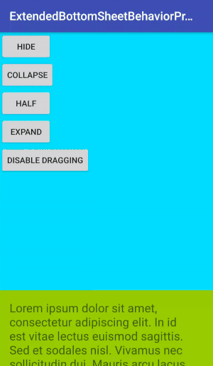

# ExtendedBottomSheetBehavior
Extends Google BottomSheetBehavior. 
Adds new state bettween STATE_EXPANDED and STATE_COLLAPSED.

DEMO
---




USAGE
---

Using ExtendedBottomSheetBehavior in your application.
Add dependencies in build.gradle of your module.

```groovy
	dependencies {
		compile 'com.riningan.widget:extendedbottomsheetbehavior:1.0'
	}
```

XML
-----

```xml
<android.support.v4.widget.NestedScrollView
        android:id="@+id/nsv"
        android:layout_width="match_parent"
        android:layout_height="match_parent"
        android:clipToPadding="true"
        app:allowDragging="true"
        app:halfOffset="172dp"
        app:hideable="true"
        app:layout_behavior="com.riningan.widget.ExtendedBottomSheetBehavior"
        app:peekHeight="128dp">
        
</android.support.v4.widget.NestedScrollView>
```
All properties from Google BottomSheetBehavior including same new:

* `app:halfOffset`              (dimension)    -> default 0
* `app:allowDragging`           (boolean)      -> default true

`halfOffset` starts from top 
`peekHeight` starts from bottom 

JAVA
-----

```java
NestedScrollView nsv = (NestedScrollView) findViewById(R.id.nsv);
ExtendedBottomSheetBehavior extendedBottomSheetBehavior = ExtendedBottomSheetBehavior.from(nsv);
extendedBottomSheetBehavior.setState(final @ExtendedBottomSheetBehavior.State int state);
extendedBottomSheetBehavior.setAllowUserDragging(boolean allowUserDragging);
```

LICENCE
-----

  	Licensed under the Apache License, Version 2.0 (the "License");
	you may not use this file except in compliance with the License.
	You may obtain a copy of the License at
	
	   http://www.apache.org/licenses/LICENSE-2.0
	
	Unless required by applicable law or agreed to in writing, software
	distributed under the License is distributed on an "AS IS" BASIS,
	WITHOUT WARRANTIES OR CONDITIONS OF ANY KIND, either express or implied.
	See the License for the specific language governing permissions and
	limitations under the License.
